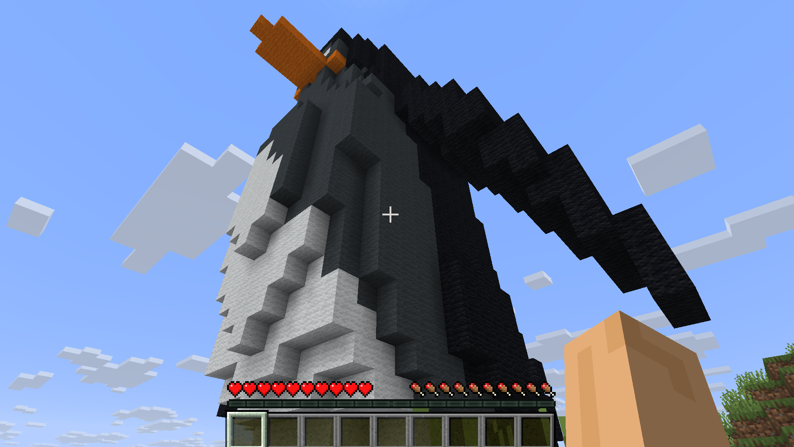

# WoolSculptor 🐧 (羊毛雕塑家)

🌍 *[English Version Below](#english-version)*

**WoolSculptor** 是一个纯本地运行的 Minecraft AI 建筑代理（Agent）。它能够监听游戏内的玩家的自然语言指令（**仅限英文!**）在本地实时生成 3D 模型，并将其自动转化为体素（Voxel），最终使用羊毛方块在你的面前将它建造出来。

**零 API 调用成本**，让你的显卡在 Minecraft 世界里真正“无中生有”。

## 💡 核心特性

* **纯本地推理**：基于 OpenAI 的 `Shap-E` 模型生成 3D 点云，相当于本地部署了一个生成模型，安全免费又快速。
* **实时空间离散化**：使用 `Open3D` 进行高效的连续空间到离散网格（体素化）的矩阵计算。好算法值得信赖
* **智能颜色匹配**：内置 RGB 欧氏距离算法，自动将 3D 模型的表面颜色映射到最接近的 Minecraft 羊毛方块数据值。
* **无缝游戏注入**：利用 `mcpi` (Minecraft Pi API) 与服务端实时通信，支持通过游戏内聊天频道直接触发生成任务。

## 🚀 效果演示

⚠️ **注意：Shap-E 模型主要基于英文语料训练，请务必使用英文输入指令，否则可能生成不可预知的形状。**

在游戏内聊天框输入：
> `!build a cute black and white penguin`


**工作流表现**：
1. 🤖 **AI Agent**: 收到指令，开始在后台唤醒扩散模型。
2. 💻 **GPU**: 满血输出，生成包含数万个顶点的 `.ply` 企鹅点云文件。
3. 🧮 **Open3D**: 对点云进行放缩、去重与体素化计算，匹配黑白黄等羊毛颜色。
4. ⛏️ **Minecraft**: 瞬间在你面前用方块搭建出一只巨型企鹅！

## 🛠️ 安装与运行

### 1. 环境准备
本项目需要你的电脑拥有一张支持 CUDA 的 Nvidia 显卡以获取最佳体验。
```bash
git clone [https://github.com/proudsheep20200320/WoolSculptor.git](https://github.com/proudsheep20200320/WoolSculptor.git)
cd WoolSculptor
pip install -r requirements.txt
```
*注：Shap-E 的安装请参考 [Shap-E 官方仓库](https://github.com/openai/shap-e) 的指引进行开发者模式安装 (`pip install -e .`)。*

### 2. Minecraft 服务端配置
* 启动带有 **BerryJuice** 或其他兼容 mcpi 协议插件的 Minecraft 服务端（推荐 Paper 1.21+）。
* 确保服务端正在本地的 `4711` 端口监听。

### 3. 启动你的羊毛雕塑家
在终端中运行：
```bash
python mcagent.py
```
进入游戏，在聊天框敲下 `!build <your prompt>`，见证魔法吧！

---

<span id="english-version"></span>
# WoolSculptor 🐧 (English Version)

**WoolSculptor** is a fully local Minecraft AI building agent. It listens to in-game player commands, generates 3D models locally in real-time using natural language prompts (**English only**), converts them into voxels automatically, and builds them right in front of you using wool blocks.

Completely open-source, **zero API costs**, bringing true "out of thin air" creation to your Minecraft world using your own GPU.

## 💡 Core Features

* **Local Inference**: Generates 3D point clouds using OpenAI's `Shap-E` model. No paid APIs required, 100% private and cost-free.
* **Real-time Voxelization**: Utilizes `Open3D` for efficient matrix calculations to map continuous 3D space into discrete voxel grids.
* **Smart Color Mapping**: Built-in RGB Euclidean distance algorithm automatically maps the 3D model's surface colors to the closest Minecraft wool block data values.
* **Seamless Game Injection**: Uses `mcpi` (Minecraft Pi API) for real-time communication with the server, triggering generation tasks directly via the in-game chat.

## 🚀 Showcase

⚠️ **Note: The underlying Shap-E model was trained primarily on English datasets. Please use English prompts only, otherwise it may generate unpredictable shapes.**

Type this in the in-game chat:
> `!build a cute black and white penguin`

**Workflow**:
1. 🤖 **AI Agent**: Receives the command and wakes up the diffusion model in the background.
2. 💻 **GPU**: Fires up and generates a `.ply` point cloud file of a penguin containing tens of thousands of vertices.
3. 🧮 **Open3D**: Scales, deduplicates, and voxelizes the point cloud, matching colors to black, white, and yellow wool blocks.
4. ⛏️ **Minecraft**: Instantly builds a giant penguin out of blocks right in front of you!

## 🛠️ Quick Start

### 1. Prerequisites
An Nvidia GPU with CUDA support is highly recommended for the best experience.
```bash
git clone [https://github.com/proudsheep20200320/WoolSculptor.git](https://github.com/proudsheep20200320/WoolSculptor.git)
cd WoolSculptor
pip install -r requirements.txt
```
*Note: For Shap-E installation, please follow the developer install guide (`pip install -e .`) on the [official Shap-E repository](https://github.com/openai/shap-e).*

### 2. Minecraft Server Setup
* Start a Minecraft server (Paper 1.21+ recommended) with **Berry** or another `mcpi` compatible plugin installed.
* Ensure the server is listening on local port `4711`.

### 3. Run Your AI Sculptor
Run this in your terminal:
```bash
python mcagent.py
```
Join the game, type `!build <your prompt>` in the chat, and witness the magic!

## 📂 Project Structure
* `mcagent.py`: The core agent logic that listens to chat, triggers the model, and executes the voxel building.
* `text_to_3d.py`: The local wrapper for the Shap-E model, converting text into `.ply` point clouds.
* `outputs/`: Default cache directory for generated models.

## 📜 License
This project is open-sourced under the [MIT License](LICENSE).